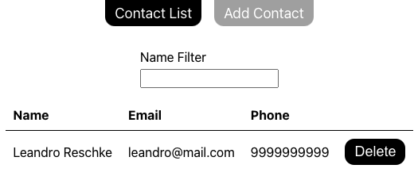

# React Contact Book

## Sumary
A simple Contact Book App made with React

This project was actually based on a pair programming I've had to a company as a front-end developer, but rewrited from the ground up with similar aspects and todo as you can see below:

### ToDo:

* 1 - Add/Remove a product to the shopping cart
* 2 - Compute total cost
* a. Can we make a reusable component for displaying a product?
* b. Can we create a new route for checkout?
* c. Can we filter the products?

I've added some extra stuff like my own css, a nice ID generator that find deleted ids that can be available for new contacts and an array of routes.
 
